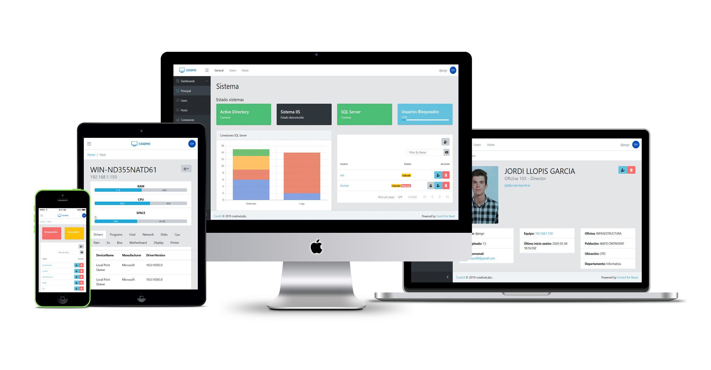
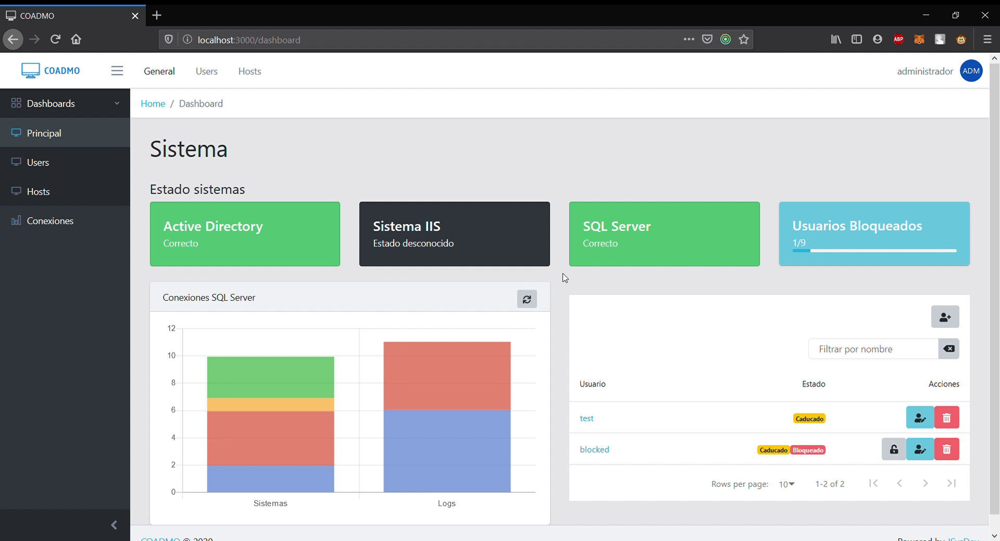
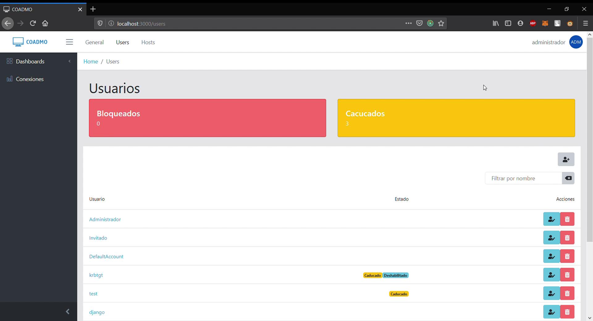
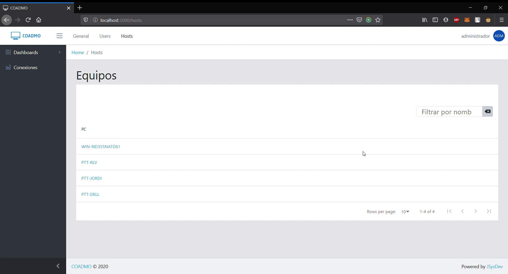
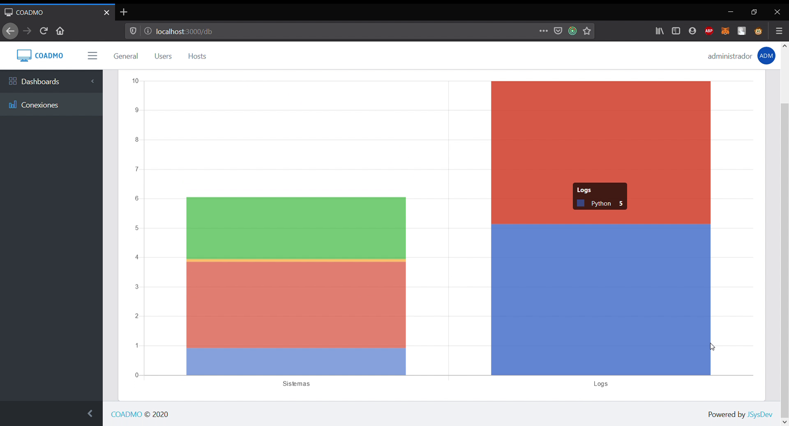
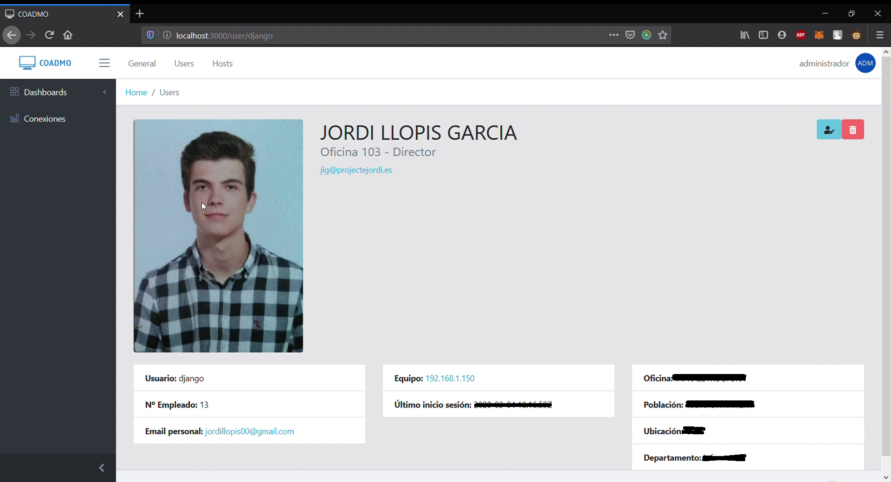
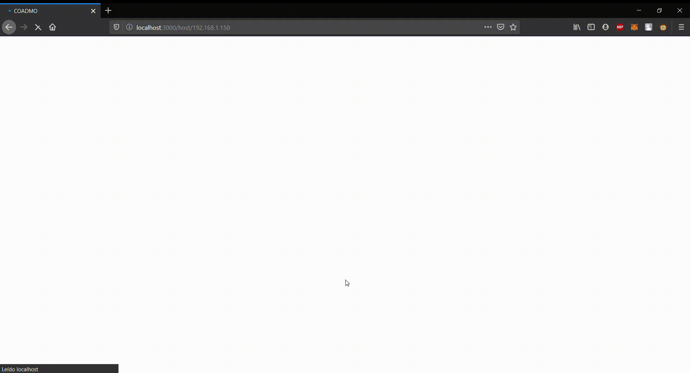

# COADMO (README in process...)

COADMO is a web aplication, that monitors services and hosts, and it give you a elegant, flexible and responsive user interface to visualize all that data.

## Technologies used

### Backend
* Django
* Django Rest Framework

#### Features
| Name | Description |
| - | - |
| [django-auth-ldap](https://github.com/django-auth-ldap/django-auth-ldap) | This is a Django authentication backend that authenticates against an LDAP service |
| [python-dotenv](https://github.com/theskumar/python-dotenv) | Reads the key-value pair from .env file and adds them to environment variable |
| [wmi](https://github.com/tjguk/wmi) | Lightweight wrapper on top of the pywin32 extensions. Hides some of the messy plumbing needed to get Python to talk to the WMI API |
| [ldap](https://github.com/python-ldap/python-ldap) | Object-oriented API to access LDAP directory servers from Python programs |

### Frontend
* ReactJS
* Redux

#### Features
| Name | Description |
| - | - |
|[CoreUI](https://github.com/coreui/coreui-free-react-admin-template)| ReactJS adapted template that lets you customize your project for almost any device (mobile, web, webapp...)|
|[react-chartjs-2](https://github.com/jerairrest/react-chartjs-2)|React wrapper for Chart.js 2|
|[jwt-decode](https://github.com/auth0/jwt-decode)| Small browser library that helps decoding JWTs token|
|[react-data-table-component](https://github.com/jbetancur/react-data-table-component)|Highly customizable data table for ReactJS|
|[Superagent](https://github.com/visionmedia/superagent)|Light-weight progressive ajax API crafted for flexibility, readability, and a low learning curve|
|[Toastr](https://github.com/CodeSeven/toastr)|A Javascript library for non-blocking notifications.|

### Database
* SQLServer

## App Features
* Logged actions
    * The application automatically saves logs of the actions that have been done, like creating users, and who did it.
* Errors control

## Dashboards

### Main
This is the principal dashboard, where the resume of the state of the systems are displayed. It contains a small cards with the status of the systems, servers, or whatever you want to monitorize. It migth contain custom components. Also has a chart that shows the different aplications that are connected to each  database, and how many connections has each app. Finally(for the time being), a datatable with the users that have any kind of a problem, it only shows the ones that are blocked or expired.

### Users
Here is where all the information about your LDAP users are displayed. It shows the quantity of blocked and expired users(with expired users I mean the users with the password expired). Behind this, a datatable with all the available users. It gives a powerful search feature, lets you add a new user, modify an existent one, unlock them, or finally, delete them. All users are tagged with his state in case they have one.

### Hosts
There is a simple list with the active hosts in the LDAP domain. Each hostname allows you to access to the profile of the host, this will be explained later.

### Connections
In this page, you can see a chart with the SQL connections. It shows the number of connections of each database separated by applications.

## Pages

### Profile user
It shows all the information about a specific user. It also provide direct links to send an email to the user and to redirect to the user's computer profile. The user can be modified, deleted or unlocked from here.

### Profile host
In the host's profile, we can see the RAM and CPU usage in real time, the space on hard drives, a hardware inventory and a software inventory.

All this data comes with asyncronous loaders for each kind of information(disk space, cpu usage, hardware inventory...). 

## Modules

## Responsive

## In progress (TODO)
* Implement a customizable drag-and-drop layout with [react-grid-layout](https://github.com/STRML/react-grid-layout).